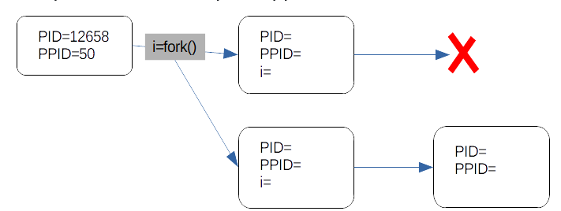

# TD1

- Quels sont les différences entre un OS préemptif et un OS collaboratif ?

**préemptif:  l'os qui va prendre la main, c'est lui qui choisis quand il donne les ressources. collaboratif: c'est le programme qui chosis quand il**

- Quelle la différence entre programme et processus ?

**processus c'est un programme qui s'execute, en cours d'execution.**

- Quels sont les principaux éléments associées à un processus pour son exécution ?

**Registre de mémoire, de fichiers**

- A quoi sert le PCB ?

**la table de processus, c'est la ou sont les différents processus qui s'éxeucte et leur **

PID = 12658
PPID = 30
i=X

PID = Y
PPID=12653
i=0

PID=X
PPID=1

## Commandes système

Votre binôme de TP (qui n'y connait rien en Linux) vous affirme qu'Apache ne lance pas plusieurs processus . Vous êtes devant une console avec un shell, comment lui prouver votre indiscutable supériorité en Linux ?

**1 processus, 4 fils**

## Executer un autre processus
Vous travaillez sur des dizaines de base mysql (sur un serveur distant ) mais vous n'arrivez pas à retenir la commande et les mots de passe. Pour cela , vous avez prit l'habitude de rechercher dans votre historique de commandes, celles qui contiennent 'mysql' en tapant simplement

`$ more ~/bash_history | grep mysql`
mais taper ces commandes avec votre portable android est aussi fastidueux que de se lever le matin à 7h pour aller écouter un cours sur la synchro des procesus. Vous avez donc décider de faire un pgm en C qui va lancer cette commande en tapant simplement

`$ lance`
Ecrivez ce programme en C avec un lancement de processus

## PGM Inutile

Ecrire un programme qui récupère la commande passée en paramètre et qui l'execute

Ecrire un programme C équivalent à la commande shell suivante : top & ps -aux

Que faudrait-il rajouter pour faire top ; ps -aux

## Je fork, tu fork ...

Ecrivez un programme  qui crée deux fils, l'un affiche les entiers de 1 à 10, l'autre de 11 à 20.

Modifiez votre code pour être sur que cela s'affiche dans l'ordre 1 2 3 ....10 11 ....20